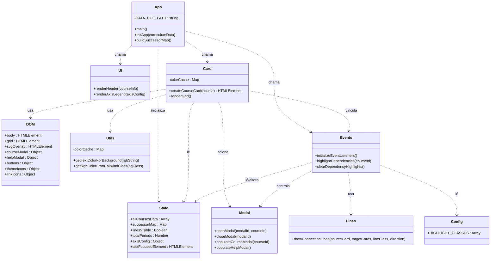
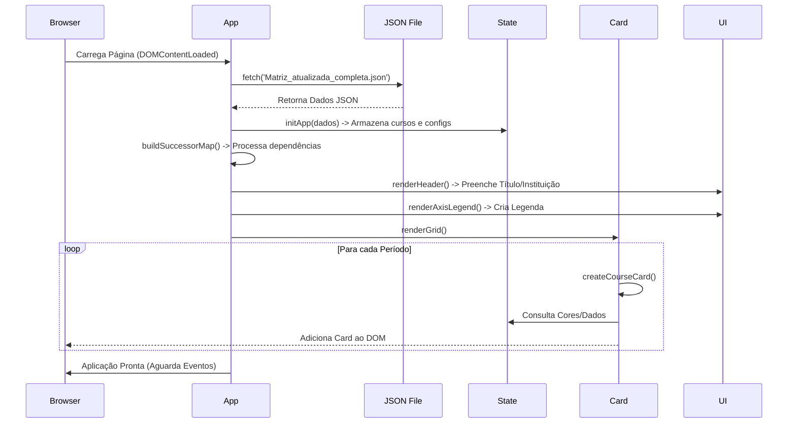

# Matriz Curricular Interativa

Um visualizador web interativo e dinâmico para matrizes curriculares, desenvolvido em JavaScript puro (Vanilla JS) com HTML5 e Tailwind CSS. O projeto foi inicialmente criado para os cursos de Engenharia Civil e de Energia do CEFET-MG, Campus Curvelo.

**Demonstrações:**
* [Matriz Engenharia Civil](https://matriz-interativa-engcivil.netlify.app/)
* [Matriz Engenharia de Energia](https://matriz-interativa-engenergia.netlify.app/)

## 📜 Descrição

Este projeto fornece uma interface limpa, responsiva e acessível para que alunos e professores possam explorar a grade curricular de um curso. Ele permite visualizar disciplinas, suas ementas, bibliografias e, o mais importante, suas interdependências (pré-requisitos, co-requisitos e disciplinas futuras que dependem dela).

A aplicação é 100% *client-side* e é totalmente configurada por um único arquivo `json`, tornando-a facilmente adaptável para qualquer curso ou instituição.

## ✨ Funcionalidades Principais

* **Visualização em Grade:** Exibe todas as disciplinas divididas por períodos.
* **Destaque de Dependências:** Ao passar o mouse ou focar (via teclado) em uma disciplina, a grade destaca visualmente:
    * Pré-requisitos
    * Co-requisitos
    * Dependências Diretas (Nível 1 - disciplinas que a atual libera)
    * Dependências Indiretas (Nível 2)
* **Linhas de Conexão:** Renderiza linhas SVG (curvas de Bézier) em tempo real para conectar visualmente as disciplinas e suas dependências. Esta função pode ser ativada ou desativada pelo usuário.
* **Detalhes da Disciplina:** Ao clicar em um card, um modal exibe informações completas, como ementa, carga horária, bibliografia básica e complementar.
* **Navegação por Requisitos:** Dentro do modal, os pré-requisitos são clicáveis, permitindo "saltar" para a visualização de outra disciplina sem fechar a navegação.
* **Design Responsivo:** Funciona em desktops, tablets e celulares. Em telas pequenas, os cards adotam um layout vertical otimizado para leitura.
* **Temas Claro e Escuro:** Inclui um seletor de tema (Light/Dark Mode) que salva a preferência do usuário no `localStorage`.
* **Legenda Dinâmica:** A legenda de eixos (ex: "Matemática", "Estruturas") é gerada automaticamente com base na configuração do arquivo de dados.
* **Acessibilidade:** Interações via teclado são suportadas (`Tab`, `Enter`, `Esc`) e o foco é gerenciado corretamente dentro dos modais.

## 📐 Arquitetura e Detalhes Técnicos

A aplicação é construída com **JavaScript moderno (ESM - ECMAScript Modules)**, sem a necessidade de *frameworks* complexos ou *build steps*. A estrutura modular separa claramente as responsabilidades do código.

### Estrutura de Pastas

```text
/
├── Matriz_atualizada_completa.json  # O CORAÇÃO DO PROJETO: Todos os dados do curso
├── index.html                       # Estrutura principal da página
├── css/
│   └── style.css                    # Estilos customizados, modo escuro e animações
└── js/
    ├── app.js                       # Ponto de entrada: carrega dados, inicializa módulos
    └── modules/
        ├── state.js                 # Gerenciador de estado global simples
        ├── dom.js                   # Cache de seletores do DOM
        ├── ui.js                    # Funções de renderização (header, legenda)
        ├── card.js                  # Lógica de renderização dos cards e da grade
        ├── events.js                # Gerenciador de todos os eventos de interação
        ├── modal.js                 # Lógica de abertura e população dos modais
        ├── lines.js                 # Lógica de desenho das linhas de conexão (SVG)
        ├── config.js                # Constantes de configuração (ex: classes de destaque)
        └── utils.js                 # Funções utilitárias (cálculo de contraste, etc.)
````

### Diagrama de Classes (Estrutura de Módulos)

O diagrama abaixo ilustra como os módulos JavaScript interagem entre si. Como o projeto utiliza Módulos ES6 e não classes tradicionais, cada bloco representa um módulo e suas funções exportadas.



### Descrição dos Módulos

  * **`app.js` (Controlador Principal):** Ponto de entrada da aplicação. Responsável por fazer o *fetch* do arquivo JSON, processar os dados iniciais (como criar o mapa de sucessores para a lógica inversa de pré-requisitos) e orquestrar a inicialização dos outros módulos.
  * **`state.js` (Gerenciador de Estado):** Objeto global simples que armazena o estado da aplicação em tempo de execução, como a lista completa de cursos, o mapa de dependências e a configuração de visibilidade das linhas.
  * **`dom.js` (Cache do DOM):** Centraliza todas as referências aos elementos HTML (botões, modais, grid). Isso evita buscas repetitivas no documento (`document.getElementById`) e melhora a performance.
  * **`card.js` (Renderização):** Responsável por criar os elementos visuais (cards) de cada disciplina e renderizar a grade curricular completa na tela, aplicando as cores corretas baseadas nos eixos.
  * **`events.js` (Interação):** Gerencia todos os eventos do usuário, como cliques, *hover* (passar o mouse), alternância de tema e lógica de destaque de dependências.
  * **`lines.js` (Visualização Gráfica):** Módulo especializado em desenhar as linhas curvas (SVG Bézier) que conectam as disciplinas quando o modo de visualização de conexões está ativo.
  * **`modal.js` (Interface Detalhada):** Gerencia a abertura, fechamento e preenchimento dinâmico de conteúdo dos modais (janelas sobrepostas) que mostram os detalhes da disciplina ou a ajuda.
  * **`utils.js` (Utilitários):** Funções auxiliares puras, principalmente para cálculo de cores e contraste para acessibilidade (decide se o texto deve ser branco ou preto dependendo da cor de fundo do card).
  * **`config.js` (Configuração):** Centraliza constantes e classes CSS utilizadas para destaque e estilização dinâmica.

### Fluxo de Inicialização de Dados



## 🔧 Como Usar ou Adaptar para Outro Curso

Adaptar este projeto para um novo currículo é simples:

1.  **Clone o repositório.**
2.  **Edite o arquivo `Matriz_atualizada_completa.json`:**
      * **`courseInfo`**: Altere o título, nome do curso e instituição.
      * **`totalPeriods`**: Defina o número de períodos/semestres.
      * **`courses`**: Substitua o array com as disciplinas do seu curso. O formato crucial é:
        ```json
        {
          "id": "CODIGO_UNICO",
          "nome": "Nome Completo",
          "ch": "60h",
          "periodo": 1,
          "eixo": "NomeDoEixo",
          "prerequisitos": ["CODIGO_REQ_1", "CODIGO_REQ_2"],
          "corequisitos": [],
          "ementa": "Texto...",
          "bibliografiaBasica": ["Livro 1"],
          "bibliografiaComplementar": [],
          "Sigla": "SIGLA", 
          "tipo": "Optativa" // Use "Optativa" para borda tracejada
        }
        ```
      * **`axisConfig`**: Defina os eixos e cores (classes Tailwind):
        ```json
        "axisConfig": {
          "NomeDoEixo": {
            "bg": "bg-blue-500",
            "text": "text-blue-800",
            "border": "border-blue-700",
            "lightBg": "bg-blue-100"
          }
        }
        ```
3.  **Execute Localmente:**
    Como o projeto usa Módulos ES, ele precisa de um servidor web local (não funciona abrindo o `index.html` direto do arquivo).
      * **VS Code:** Instale a extensão "Live Server" e clique em "Go Live".
      * **Python 3:** Execute `python -m http.server` e acesse `http://localhost:8000`.

## 🧑‍💻 Créditos

Criado pela **Prof.ª Carolina Vieira** e **Prof. Ezequiel Lima** (ezequiel@cefetmg.br) - CEFET-MG, Campus Curvelo, com o auxílio da IA Gemini do Google.
